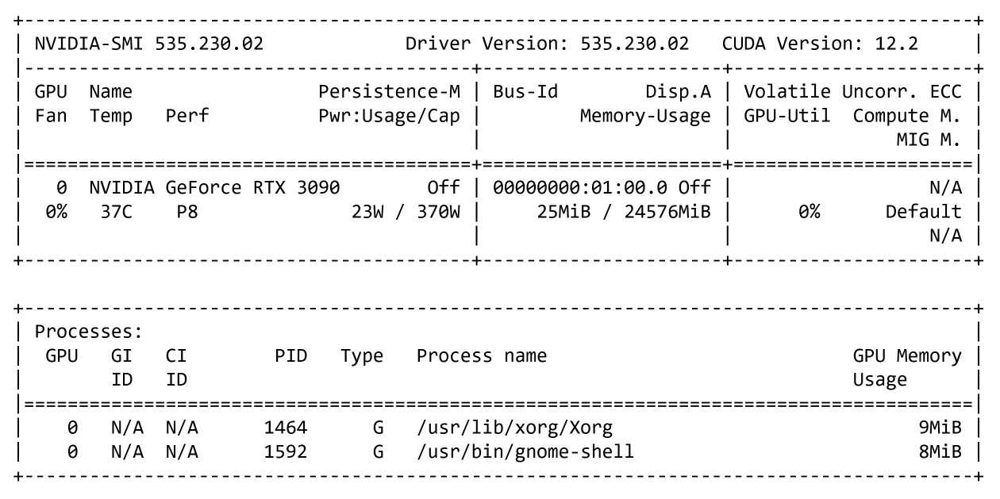

# 🧠 MLOps System 시스템 설치 & 실습 가이드

`mlops` 프로젝트는 NVIDIA GeForce RTX 3090 GPU 0번을 활용한 **MLOps System 설치 & 실습 가이드**입니다. Docker 설치, Kubernetes 설정, Kubeflow & BentoML 실습 예제 등을 포함합니다.

### 🖥️ 서버 정보

- **GPU**: NVIDIA GeForce RTX 3090(24GB)
- **OS**: Ubuntu 24.04.1 LTS
- **CUDA**: 12.2
- **NVIDIA Driver**: 535.230.02
- **Python**: 3.12.3
- **환경 관리**: Container, Kubernetes

